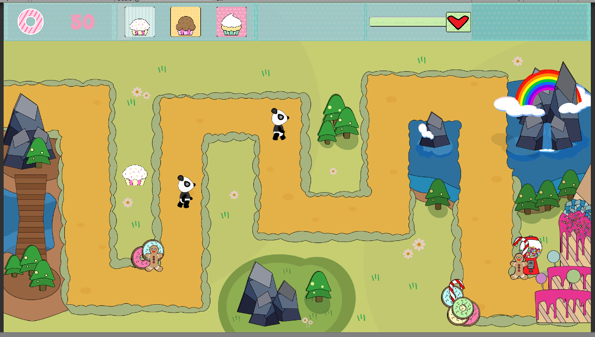

# Panda-Invasion

Panda Invasion is a 2D real-time tower defense game where the player must defeat Pandas with various edible projectiles. This is the almost completed project is from the book "Getting Started with Unity 5.x 2D Game Development".

## Getting started

Folow the instructions below to get started with Panda Invasion

1. Make sure you have all requirements
2. Download source Code 
3. Open Project in Unity 2018 and enjoy.

### Todo

1. Add Background Sounds and sound effects.
2. Collecting sugar count.
